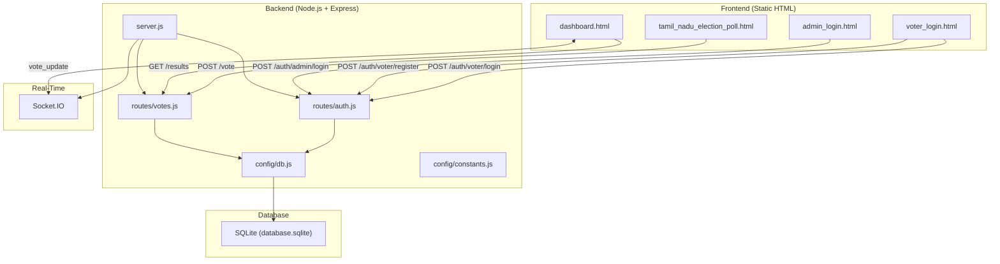
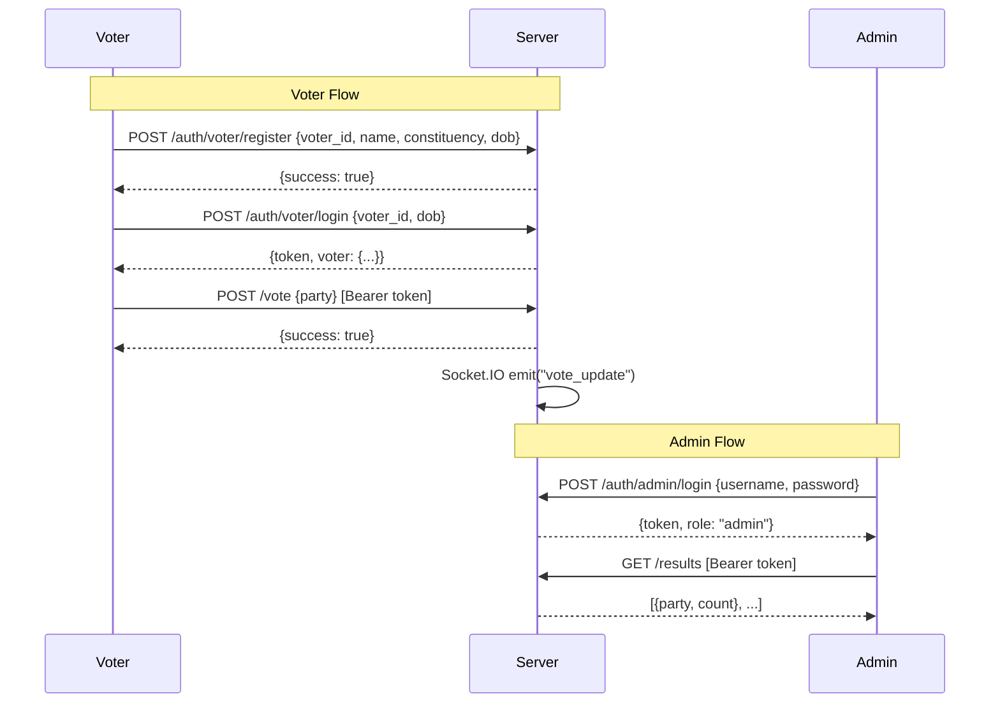
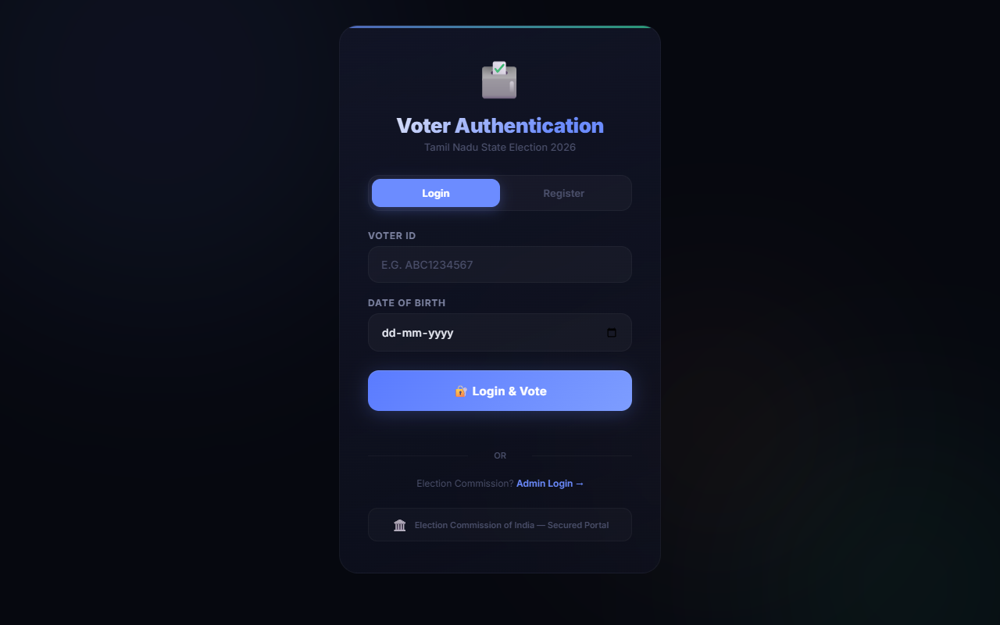
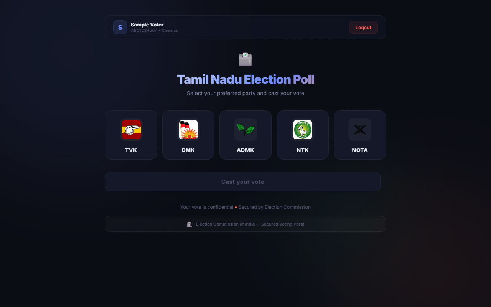
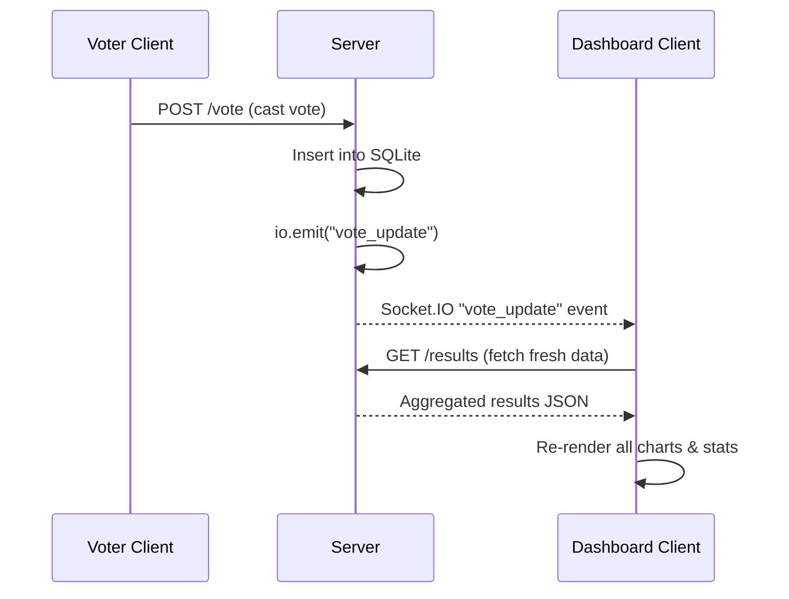
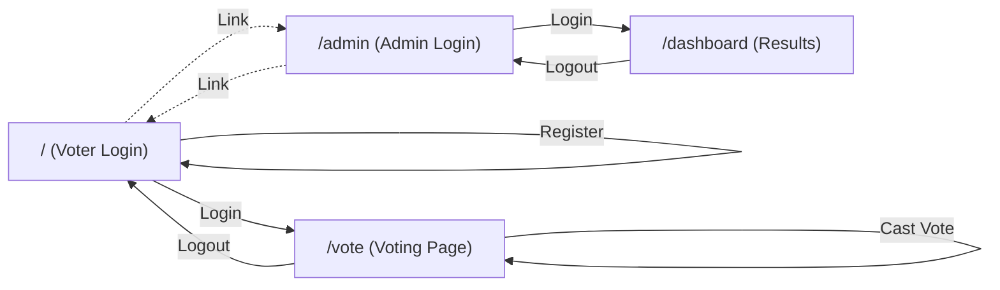

# 🗳️ Tamil Nadu Election 2026 — Voting Simulation App

> A full-stack election voting simulation with JWT-based dual authentication (Voter + Admin), real-time results via Socket.IO, and a premium glassmorphic dark-themed UI.

---

## 📐 Architecture Overview



---

## 🛠️ Tech Stack

| Layer | Technology | Purpose |
|-------|-----------|---------|
| **Runtime** | Node.js | Server-side JavaScript |
| **Framework** | Express 5.x | HTTP server & routing |
| **Database** | SQLite 3 (via [sqlite](file:///e:/voting%20app/database.sqlite) + `sqlite3`) | Persistent vote & voter storage |
| **Auth** | JWT (`jsonwebtoken`) + `bcryptjs` | Token-based authentication |
| **Real-Time** | Socket.IO 4.x | Live dashboard updates on new votes |
| **Rate Limiting** | `express-rate-limit` | Brute-force protection on `/vote` & `/auth` |
| **Logging** | `morgan` | HTTP request logging (dev mode) |
| **CORS** | `cors` | Cross-origin requests |
| **Charting** | Chart.js 4.x (CDN) | Doughnut, bar, and polar area charts |
| **Fonts** | Google Fonts (Inter, JetBrains Mono) | Premium typography |
| **Env Config** | `dotenv` | Environment variable management |

---

## 📁 Project Structure

```
e:\voting app\
├── package.json                    # Root proxy — runs backend
├── database.sqlite                 # Root-level DB (unused, legacy)
│
├── voter_login.html                # 🔐 Voter registration & login
├── tamil_nadu_election_poll.html   # 🗳️ Voting page (party selection)
├── admin_login.html                # 🛡️ Admin/EC login portal
├── dashboard.html                  # 📊 Live results dashboard
│
└── backend/
    ├── .env                        # Environment variables
    ├── package.json                # Backend dependencies
    ├── server.js                   # Express app entry point
    │
    ├── config/
    │   ├── db.js                   # SQLite connection & table creation
    │   └── constants.js            # Valid party list
    │
    ├── models/
    │   └── Vote.js                 # Mongoose schema (legacy, unused)
    │
    ├── routes/
    │   ├── auth.js                 # Voter & Admin auth endpoints + middleware
    │   └── votes.js                # Vote casting & results endpoints
    │
    ├── seed.js                     # Seeds 150K random votes
    ├── rank_votes.js               # Bulk resets DB to a specific distribution
    ├── shift.js                    # Transfers votes between parties
    ├── update_votes.js             # Redistributes excess NOTA votes
    └── database.sqlite             # Active SQLite database (~24 MB)
```

---

## 🗄️ Database Schema

The app uses **SQLite** with two tables, auto-created on startup by [db.js](file:///e:/voting%20app/backend/config/db.js):

### `votes` Table
| Column | Type | Constraints | Description |
|--------|------|-------------|-------------|
| [id](file:///e:/voting%20app/tamil_nadu_election_poll.html#402-421) | INTEGER | PRIMARY KEY AUTOINCREMENT | Auto-increment ID |
| `user_id` | TEXT | UNIQUE NOT NULL | Voter ID who cast the vote |
| `party` | TEXT | NOT NULL | Party voted for (`tvk`, `dmk`, `admk`, `ntk`, `nota`) |
| `created_at` | DATETIME | DEFAULT CURRENT_TIMESTAMP | Vote timestamp |

### `voters` Table
| Column | Type | Constraints | Description |
|--------|------|-------------|-------------|
| [id](file:///e:/voting%20app/tamil_nadu_election_poll.html#402-421) | INTEGER | PRIMARY KEY AUTOINCREMENT | Auto-increment ID |
| `voter_id` | TEXT | UNIQUE NOT NULL | Voter ID (format: `ABC1234567`) |
| `name` | TEXT | NOT NULL | Full name |
| `constituency` | TEXT | NOT NULL | Constituency name |
| `dob` | TEXT | NOT NULL | Date of birth (YYYY-MM-DD) |
| `has_voted` | INTEGER | DEFAULT 0 | 0 = not voted, 1 = already voted |
| `created_at` | DATETIME | DEFAULT CURRENT_TIMESTAMP | Registration timestamp |

---

## 🔌 API Endpoints

### Authentication Routes — [auth.js](file:///e:/voting%20app/backend/routes/auth.js)

| Method | Endpoint | Auth | Description |
|--------|----------|------|-------------|
| `POST` | `/auth/voter/register` | None | Register a new voter |
| `POST` | `/auth/voter/login` | None | Login with Voter ID + DOB, returns JWT |
| `POST` | `/auth/admin/login` | None | Admin login with username/password, returns JWT |

### Voting Routes — [votes.js](file:///e:/voting%20app/backend/routes/votes.js)

| Method | Endpoint | Auth | Description |
|--------|----------|------|-------------|
| `POST` | `/vote` | [verifyVoter](file:///e:/voting%20app/backend/routes/auth.js#115-132) (JWT) | Cast a vote for a party |
| `GET` | `/results` | [verifyAdmin](file:///e:/voting%20app/backend/routes/auth.js#133-149) (JWT) | Get aggregated vote counts per party |

### Page Routes — [server.js](file:///e:/voting%20app/backend/server.js)

| Method | Endpoint | Serves |
|--------|----------|--------|
| `GET` | `/` | [voter_login.html](file:///e:/voting%20app/voter_login.html) |
| `GET` | `/vote` | [tamil_nadu_election_poll.html](file:///e:/voting%20app/tamil_nadu_election_poll.html) |
| `GET` | `/admin` | [admin_login.html](file:///e:/voting%20app/admin_login.html) |
| `GET` | `/dashboard` | [dashboard.html](file:///e:/voting%20app/dashboard.html) |

---

## 🔐 Authentication Flow



### JWT Token Details

| Role | Payload | Expiry |
|------|---------|--------|
| **Voter** | `{type: "voter", voter_id, name, constituency, has_voted}` | 2 hours |
| **Admin** | `{type: "admin", username}` | 8 hours |

### Middleware Guards

- **[verifyVoter()](file:///e:/voting%20app/backend/routes/auth.js#115-132)** — Validates JWT, ensures `type === "voter"`, attaches `req.voter`
- **[verifyAdmin()](file:///e:/voting%20app/backend/routes/auth.js#133-149)** — Validates JWT, ensures `type === "admin"`, attaches `req.admin`

---

## 🎨 Frontend Pages

### 1. Voter Login — [voter_login.html](file:///e:/voting%20app/voter_login.html)

- **Tabbed interface**: Login / Register
- **Registration** collects: Voter ID (`ABC1234567` format), Full Name, Constituency (15 TN constituencies), DOB
- **Login** requires: Voter ID + DOB
- Stores `voter_token` and `voter_info` in `localStorage`
- Auto-redirects authenticated users to `/vote`
- Links to Admin login

### 2. Voting Page — [tamil_nadu_election_poll.html](file:///e:/voting%20app/tamil_nadu_election_poll.html)

- **Auth-gated**: Redirects to `/` if no voter token
- Displays voter info bar (name, voter ID, constituency)
- **5 party cards** in a grid: TVK, DMK, ADMK, NTK, NOTA
- Card selection → enables "Cast your vote" button
- Sends authenticated `POST /vote` with Bearer token
- Prevents re-voting (checks `has_voted` flag)
- Logout clears localStorage

### 3. Admin Login — [admin_login.html](file:///e:/voting%20app/admin_login.html)

- Gold/amber themed UI with "Restricted Access" badge
- Username + Password form with show/hide toggle
- Stores `admin_token` in `localStorage`
- Auto-redirects authenticated admins to `/dashboard`

### 4. Results Dashboard — [dashboard.html](file:///e:/voting%20app/dashboard.html)

- **Auth-gated**: Redirects to `/admin` if no admin token
- **Real-time updates** via Socket.IO + 5-second polling fallback
- **Components**:
  - 🏆 Winner banner (current leader with votes, share, lead)
  - 📊 4 hero stat cards (total votes, parties, leader, margin)
  - Party detail cards (per-party stats with progress bars)
  - 🏅 Leaderboard (ranked list with mini bar charts)
  - 🍩 Doughnut chart (vote share)
  - 📈 Horizontal bar chart (vote distribution)
  - 📉 Polar area chart (vote share comparison)
- Uses Chart.js 4.x for all visualizations
- Indian number formatting (K, L, Cr suffixes)

---

## 🏛️ Supported Parties

Defined in [constants.js](file:///e:/voting%20app/backend/config/constants.js):

| ID | Party | Full Name | Color |
|----|-------|-----------|-------|
| `tvk` | TVK | Tamilaga Vettri Kazhagam | `#3266ad` |
| `dmk` | DMK | Dravida Munnetra Kazhagam | `#1d9e75` |
| `admk` | ADMK | All India Anna DMK | `#ba7517` |
| `ntk` | NTK | Naam Tamilar Katchi | `#d85a30` |
| `nota` | NOTA | None Of The Above | `#6b6e78` |

---

## ⚙️ Utility Scripts

These are standalone CLI scripts for database manipulation:

| Script | Command | Purpose |
|--------|---------|---------|
| [seed.js](file:///e:/voting%20app/backend/seed.js) | `node seed.js` | Clears all votes, inserts **150,000** random votes |
| [rank_votes.js](file:///e:/voting%20app/backend/rank_votes.js) | `node rank_votes.js` | Resets DB to a fixed distribution: TVK 85K, DMK 60K, ADMK 45K, NTK 20K, NOTA 1K |
| [shift.js](file:///e:/voting%20app/backend/shift.js) | `node shift.js` | Transfers **5,000** votes from TVK → DMK |
| [update_votes.js](file:///e:/voting%20app/backend/update_votes.js) | `node update_votes.js` | Reduces NOTA to 1,000 votes, distributes excess to other parties |

> [!NOTE]
> [rank_votes.js](file:///e:/voting%20app/backend/rank_votes.js) uses SQLite transactions with batch inserts of 500 rows for optimal performance when inserting 211,000 total votes.

---

## 🔒 Security Features

| Feature | Implementation |
|---------|---------------|
| **JWT Authentication** | Separate voter/admin tokens with role-based access |
| **Rate Limiting** | 100 requests per 15 minutes on `/vote` and `/auth` |
| **Input Validation** | Voter ID regex, required fields, party whitelist |
| **Duplicate Vote Prevention** | `UNIQUE` constraint on `user_id` in votes + `has_voted` flag in voters |
| **CORS** | Enabled for all origins (development mode) |
| **Environment Variables** | Secrets stored in [.env](file:///e:/voting%20app/backend/.env) file |
| **Port Recovery** | Auto-kills process occupying the port on Windows |

---

## 🌐 Real-Time Architecture



- Socket.IO pushes instant notifications on every new vote
- Dashboard also polls every 5 seconds as a fallback
- Charts animate smoothly on data updates

---

## 🚀 Setup & Run

### Prerequisites
- Node.js (v18+)
- npm

### Installation
```bash
cd "e:\voting app\backend"
npm install
```


### Start Server
```bash
# From root
npm start

# Or from backend
cd backend
node server.js
```

The server starts at **http://localhost:3000**


---

## 🗺️ User Flow Summary



---

## ⚠️ Known Considerations

> [!WARNING]
> - [models/Vote.js](file:///e:/voting%20app/backend/models/Vote.js) contains a **Mongoose schema** that is **not used** — the app uses SQLite directly. The `mongoose` dependency in [package.json](file:///e:/voting%20app/package.json) is also unused.
> - CORS is set to `origin: "*"` — should be restricted in production.
> - Admin credentials are stored as plaintext in [.env](file:///e:/voting%20app/backend/.env) (not hashed).
> - The root [database.sqlite](file:///e:/voting%20app/database.sqlite) (16 KB) appears to be a leftover; the active database is at [backend/database.sqlite](file:///e:/voting%20app/backend/database.sqlite) (24 MB).

> [!TIP]
> - The `MONGO_URI` in [.env](file:///e:/voting%20app/backend/.env) is unused — the app runs entirely on SQLite.
> - For production, consider adding HTTPS, stricter CORS, hashed admin passwords, and a proper session store.
